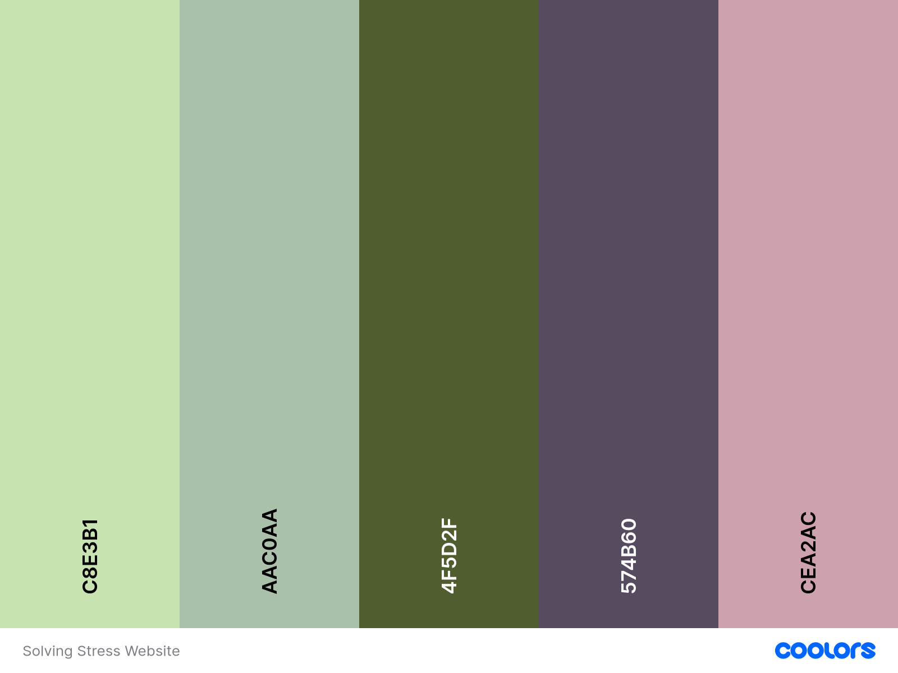

# Solving Stress

## By Alice Hallahan

### Project Brief 4: Mental Health Awareness

### Table of Contents

1. Introduction/Overview
2. UX Design
3. Development Considerations
4. Testing
5. Future Features
6. Project Deployment
7. Known Bugs
8. Repository and Project Board
9. Credits

## Introduction

Welcome to Solving Stress, a website designed to provide beginner-friendly information on mental health, including how to recognise the signs and impact of stress, as well as view practical tips and information on how to manage stress more effectively, presented in a supportive and organised layout for the user.

The website provides a section outlining feelings associated with stress, physical symptoms, the behaviours associated with stress and an outline of what can cause it.

## UX Design

Solving Stress is designed to be intuitive to use, with information presented in a clear and easy-to-read way. A navigation bar is placed at the top to help the user to move around the site. The footer can be found at the bottom providing contact information and links to social media pages.

The hero image is used at the start of the page to provide an insight into the themes that will be explored in the site and to inspire a feeling of calm.

The "What are the signs of stress?" has been presented in a card layout, with four cards displaying key information in bullet point format. The cards are responsive and shrink when viewed on smaller screens.

The banner with sliding information was designed using Javascript and is there to provide a more interactive focus for key information, providing practical details for the user on how to combat stress.

### Style

A colour palette focusing on different shades of green as well as some contrasting darker colours (English violet and Rosy brown) from Coolers was used to provide a consistent colour theme throughout the site.

### Development Considerations

Upon deciding to choose mental health awareness with stress as the focal point, I considered the key features of the site and designed basic wireframes and mockup sites to help refine the design process.

I used a brainstorming process to consider the user goals, key features, potential ideas and key components. An image of my brainstorm is shown below:

I created user-stories to provide a solid foundation on who might use the site and for what purpose. Key users included busy professionals, parents, wellbeing managers, health conscious individuals and employees - the site needed to provide clear and concise information on stress, as well as practical tips that could be used to help manage it on a day to basis.

Mockup designs helped to refine the style and layout for mobiles and larger screens:  

The images on the site were separated into two categories, one was linked to feelings of calm and meditation. The second category of images were used for the card section and were selected because they helped to represent the categories topics more visually/creatively.  

## Testing

The website was tested in the following ways before finalisation:

- W3 validation - this highlighted that some images were saved with spaces in the name which were fixed
- W3 CSS validation - passed CSS checks
- User testing - use of Chrome DevTools to check responsiveness. Images were fixed to work better across devices of different screen sizes.
- Deployment - upon deployment CSS links and the hero image link did not work, this was fixed by reviewing the file path

Accessibility: testing also checked that images had alt text added and aria-labels were included where necessary to support accessible use.

## Future Features

Moving forward the user experience could be enhanced by incorporating the following elements:

- Adding additional pages to the site which provide more information such as a page with useful links to external sites that can support people struggling with stress
- Adding video content to provide a new format for the delivery of key information  
- Further user testing with wider groups to ensure image and text sizing works effectively

## Website Deployment

The site was deployed using GitHub pages.

The website can be found here: <https://ahalla-ma.github.io/solving-stress/>

## Credits

### Images

All images used throughout the site are sourced from Canva <https://www.canva.com>

### Content

The information on stress was sourced from:

- Mind.Org <https://www.mind.org.uk>
- Harvard Medical School <https://www.health.harvard.edu/staying-healthy/exercising-to-relax>
- Mental Health Foundation <https://www.mentalhealth.org.uk/explore-mental-health/publications/how-manage-and-reduce-stress>

## Technologies Used

The following technologies were used in the development of this site:

- VS Copilot for coding queries
- Bootstrap components
- MS Copilot - assisted with Javascript code for slides
- Fontawesome - used for bullet point links on cards and social media links
